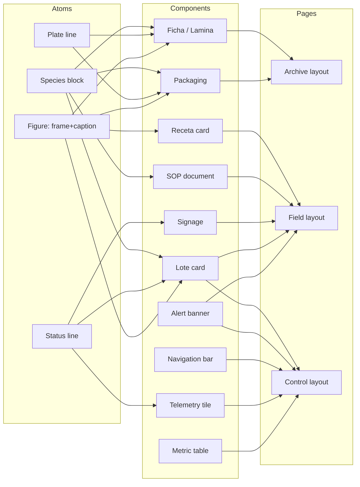

# Setas de la Peña · DS-2026

A design system for a mushroom farm at 2.600 m in Tenjo, Cundinamarca — one
system covering the field (lot records, substrate recipes, room signage, SOPs)
and the shelf (packaging, fichas, market cards).

**Governing idea:** every mark on the page is either evidence or navigation.
Colour is classification or state. Imagery is documentation. Type carries the
difference between what a person reads, what a person acts on, and what a
machine emitted. Nothing is decoration.

> **Relationship to FOS.** This is a **standalone** system. The repo also
> contains `08_brand/field-os-identity/` (the Field Operating System), which is
> a different, independently audited system with its own palette and rules.
> DS-2026 does not import from it, alias it, or replace it — the two are kept
> apart deliberately. See [§10](#10-relationship-to-fos) before mixing them.

---

## 0 · Canonical Architecture (4-Tier Stack)

```text
DS-2026 · Criterio
│
├── CORE
│   typography
│   color
│   spacing
│   grid
│   interaction
│
├── SHARED
│   status
│   metadata
│   provenance
│   actions
│   forms
│
├── OPERATIONS
│   lot
│   room
│   task
│   event
│   inventory
│   telemetry
│   scan/capture
│   sync
│
└── SETAS OS
    Hoy
    Lotes
    Salas
    Inventario
    Recetas
    Conocimiento
```

---

## 1 · Foundations

### 1.1 Typefaces

Three families, three jobs. A face used outside its job is a bug.

| Family | Role | Where it appears | Stack |
|---|---|---|---|
| **Gaya Patched** | Editorial / species | Common names, latin binomials, titles, packaging, signage | `'Gaya Patched', 'Iowan Old Style', Georgia, serif` |
| **IBM Plex Sans** | Body / UI | Prose, descriptions, navigation, button labels | `'IBM Plex Sans', 'Helvetica Neue', Arial, sans-serif` |
| **IBM Plex Mono** | Field metadata | Lot codes, taxon codes, coordinates, telemetry, table headers | `'IBM Plex Mono', ui-monospace, 'SF Mono', Menlo, monospace` |

All faces are **vendored** in `assets/fonts/` — no CDN. A field tablet at 2.600 m
with no signal must render the system identically to a desktop.

Gaya Patched ships the full family: Thin (100), Light (300), Regular (400),
Medium (500), Bold (700), Black (900), each with a matching italic.

**Mono metadata and labels are uppercase and tracked ≥ 0.15em. Numeric measurements and tabular data remain untracked.** Tracking expresses metadata grammar; it is never applied blindly to figures.

### 1.2 Type scale

`DISPLAY 01` (64px Gaya Black) down to `MICRO` (11px screen / 9px print). Standardized roles.

| Role | Size | Family | Weight | Leading | Tracking | Case | Use |
|---|---|---|---|---|---|---|---|
| `display-01` | 64px | Gaya Patched | 900 Black | 0.98 | −0.02em | — | Cover titles, packaging front, poster. One per surface. |
| `display-02` | 44px | Gaya Patched | 700 Bold | 1.10 | −0.02em | — | Section openers, signage room name. |
| `heading-01` | 32px | Gaya Patched | 500 Medium | 1.10 | −0.01em | — | Document title, dashboard masthead. |
| `heading-02` | 24px | Gaya Patched | 500 Medium | 1.10 | −0.01em | — | Card and panel titles. |
| `heading-03` | 19px | IBM Plex Sans | 600 SemiBold | 1.30 | 0 | — | Sub-headings in prose and SOP steps. |
| `species` | 28px | Gaya Patched | 700 Bold | 1.10 | −0.01em | — | Common name — *Shiitake*, *Melena de león*. |
| `latin` | 18px | Gaya Patched | 400 *Italic* | 1.30 | 0 | — | Binomial — *Lentinula edodes*. Always italic, always sentence case. |
| `body` | 16px | IBM Plex Sans | 400 Regular | 1.55 | 0 | — | Prose floor. Never lower, screen or print. |
| `small` | 14px | IBM Plex Sans | 400 Regular | 1.55 | 0 | — | Captions, secondary UI, dense card copy. |
| `data` | 13px | IBM Plex Mono | 400 Regular | 1.40 | 0 | — | Table numbers, telemetry, measurements. Tabular figures. |
| `label` | 11px | IBM Plex Mono | 500 Medium | 1.10 | **0.15em** | UPPER | Field keys, table headers, taxon codes, lot lines. |
| `micro-screen` | 11px | IBM Plex Mono | 400 Regular | 1.10 | **0.18em** | UPPER | Screen metadata floor, badges, timestamps, tags. |
| `micro-print` | 9px | IBM Plex Mono | 400 Regular | 1.10 | **0.18em** | UPPER | Physical fine print only: plate refs, folio marks, secondary legal copy. Never a lot code. |
| `lot-code-print` | 6mm | IBM Plex Mono | 600 SemiBold | 1.10 | **0.08em** | UPPER | Physical lot/date code role; final output must verify x-height ≥ 3mm. |

**Normative minimums**

- Prose never below **16px**, screen or print.
- Below **13px** there is no operative content — metadata only.
- Screen metadata floor is strictly **11px** (`--size-micro-screen`).
- `--size-micro-print: 9px` is fine print only.
- Printed physical lot/date code uses `--size-lot-code-print: 6mm` and must verify **x-height ≥ 3mm** in the final physical output.

### 1.3 Colour

Mineral pigment roles and functional semantic mappings.

| Primitive Token | Hex | Role |
|---|---|---|
| `PAPER` (`paper-100`) | `#F6F4EC` | Warm ivory paper ground. Natural cellulose foundation. |
| `PAPER_50` | `#FCFBF6` | Ultra-light paper ground for high-contrast cards. |
| `PAPER_200` | `#EDE8DB` | Darker warm paper for recessed wells and table alternating rows. |
| `INK` (`ink-900`) | `#1A1410` | Deep carbon black. Primary text, heavy rules. |
| `INK_700` | `#3A2F26` | Dark bistre. Secondary text, structural labels. |
| `INK_MUTED` (`ink-500`) | `#6B5B4A` | Muted umber. Captions, metadata keys, tertiary notes. |
| `RULE` | `#BFA98B` | Mineral rule hairline (`sand-500` / sand tint). |
| `MOSS` (`moss-900`) | `#1E2A16` | Deep pine/forest green. In-spec status, successful batch events. |
| `MOSS_700` | `#2E3B2F` | Forest floor green. Intermediate vegetative status. |
| `CORAL_500` | `#B8614D` | Terracotta / Coral. Non-text brand accent, focus rings, timeline markers. |
| `CORAL_700` | `#8A3E2D` | Deep cinnabar / dark coral. **AA Compliant brand accent text** on paper (6.79:1). |
| `RUST` | `#8A3E2D` | Deep mineral rust. Error, contamination, and critical alert text. |
| `WARNING` | `#C49A4C` | Muted ochre. Caution and quarantine. **Non-text use only** (2.36:1). |
| `WARNING_TEXT` | `#866629` | Darkened ochre. **AA Compliant caution text** on paper (4.83:1). |
| `SLATE_500` | `#4E6A7A` | Blue slate. Secondary telemetry, humidity & moisture metrics. |
| `BARK_700` | `#594631` | Dark oak bark. Structural wood substrate tags and dark framing. |

Derived surfaces & semantic roles:

| Semantic Token | Value / Hex | Derivation / Purpose |
|---|---|---|
| `--surface-page` | `#F6F4EC` | Primary page foundation |
| `--surface-panel` | `#FCFBF6` | Elevated cards, table headers, panels |
| `--surface-recessed` | `#EDE8DB` | Wells, input backgrounds, alternating table rows |
| `--text-primary` | `#1A1410` | High contrast body and titles (16.56:1 AA) |
| `--text-secondary` | `#3A2F26` | Section headers and structural UI (11.41:1 AA) |
| `--text-tertiary` | `#6B5B4A` | Captions and metadata keys (5.92:1 AA) |
| `--brand-accent` | `#B8614D` | Fills, badges, rule highlights (non-text, 3.93:1) |
| `--brand-accent-text` | `#8A3E2D` | Accessible brand text on paper (6.79:1 AA) |
| `--status-ok` | `#1E2A16` | Operational success, in-spec (10.70:1 AA) |
| `--status-warn` | `#866629` | Caution, pending sync, quarantine (4.83:1 AA) |
| `--status-err` | `#8A3E2D` | Critical alarm, batch loss (6.79:1 AA) |

**Coral Taxonomy:**
- `--brand-accent` (`coral-500` #B8614D): Strictly for non-text fills, active indicators, and graphical rules. Never used for text on paper.
- `--brand-accent-text` (`coral-700` #8A3E2D): Strictly for text on paper requiring the terracotta brand signature, clearing WCAG AA at 6.79:1.

### 1.4 Contrast audit — WCAG AA compliance (27/27)

`scripts/contrast-audit.py` enforces normative color contracts. Any regression exits non-zero:

| Foreground | Background | Purpose | Needs | Ratio | Rule |
|---|---|---|---|---|---|
| `INK` | `PAPER` | Body, headings, species names | 4.5:1 | 16.56:1 | Sanctioned |
| `INK` | `PAPER_PANEL` | Text on panels | 4.5:1 | 17.60:1 | Sanctioned |
| `INK` | `PAPER_RECESSED` | Text in recessed wells | 4.5:1 | 14.91:1 | Sanctioned |
| `INK_MUTED` | `PAPER` | Captions, metadata values | 4.5:1 | 5.92:1 | Sanctioned |
| `INK_MUTED` | `PAPER_PANEL` | Metadata on panels | 4.5:1 | 6.29:1 | Sanctioned |
| `MOSS` | `PAPER` | OK status text | 4.5:1 | 10.70:1 | Sanctioned |
| `MOSS` | `MOSS_TINT` | OK text on OK banner | 4.5:1 | 10.09:1 | Sanctioned |
| `CORAL_700` | `PAPER` | Brand accent text / error status text (AA) | 4.5:1 | 6.79:1 | Sanctioned |
| `RUST` | `PAPER` | Error status text | 4.5:1 | 6.79:1 | Sanctioned |
| `RUST` | `RUST_TINT` | Error text on error banner | 4.5:1 | 6.49:1 | Sanctioned |
| `SOIL` | `PAPER` | Infill label text | 4.5:1 | 8.13:1 | Sanctioned |
| `PAPER` | `SOIL` | Inverse text on soil block (signage) | 4.5:1 | 8.13:1 | Sanctioned |
| `PAPER` | `MOSS` | Text on solid moss fill | 4.5:1 | 10.70:1 | Sanctioned |
| `PAPER` | `RUST` | Text on solid rust fill | 4.5:1 | 6.79:1 | Sanctioned |
| `INK` | `WARNING` | Text on solid ochre fill | 4.5:1 | 7.01:1 | Sanctioned |
| `WARNING_TEXT` | `PAPER` | Caution text (sanctioned ochre) | 4.5:1 | 4.83:1 | Sanctioned |
| `INK` | `WARNING_TINT` | Caution banner text (sanctioned) | 4.5:1 | 16.32:1 | Sanctioned |
| `RULE` | `PAPER` | Hairlines, specimen frames (non-text) | 3.0:1 | 3.22:1 | Sanctioned |
| `MOSS` | `PAPER` | Meter fill (non-text) | 3.0:1 | 10.70:1 | Sanctioned |
| `CORAL_500` | `PAPER` | Terracotta brand accent fill / rule (non-text) | 3.0:1 | 3.93:1 | Sanctioned |
| `ACCENT_WARM` | `PAPER` | Archive accent fill / rule (non-text) | 3.0:1 | 3.93:1 | Sanctioned |
| `WARNING` | `PAPER` | Ochre as TEXT — use WARNING_TEXT | 4.5:1 | 2.36:1 | **Banned** |
| `WARNING` | `WARNING_TINT` | Ochre text on its own tint — use INK | 4.5:1 | 2.33:1 | **Banned** |
| `PAPER` | `WARNING` | Paper on ochre fill — use INK | 4.5:1 | 2.36:1 | **Banned** |
| `WARNING` | `PAPER` | Ochre hairline/meter alone — needs INK | 3.0:1 | 2.36:1 | **Banned** |
| `CORAL_500` | `PAPER` | Coral 500 as body TEXT — fails AA (3.93:1) | 4.5:1 | 3.93:1 | **Banned** |
| `ACCENT_WARM` | `PAPER` | Archive accent as TEXT — never; fails AA | 4.5:1 | 3.93:1 | **Banned** |

27/27 expectations hold

---

## 2 · Grid & spacing

### 2.1 Spacing

An **8px** baseline. Every gap, pad and offset is a multiple.

| Token | Value | | Token | Value |
|---|---|---|---|---|
| `--space-half` | 4px | | `--space-5` | 40px |
| `--space-1` | 8px | | `--space-6` | 48px |
| `--space-2` | 16px | | `--space-7` | 64px |
| `--space-3` | 24px | | `--space-8` | 80px |
| `--space-4` | 32px | | `--space-9` | 96px |

`--space-half` (4px) is the **single** sub-8 exception, for optical alignment
against a 1px hairline. There is no 2px, no 6px, no 10px.

### 2.2 The 12-column grid and its three modes

Twelve columns everywhere. **Density is a mode, not a new grid.** Set
`data-mode` on any container and the gutter and page margin follow.

| Mode | Gutter | Page margin | Used by |
|---|---|---|---|
| `archive` | **32px** | 64px | Editorial and print — fichas, packaging, posters, the folio system. Air is the point. |
| `field` | **24px** | 32px | Reports, labels, lot records, SOPs. **The default.** |
| `control` | **12px** | 16px | Dense telemetry — dashboards, metric tables, room monitors. |

```html
<div data-mode="control">
  <div class="grid">
    <div class="col-8">…</div>
    <div class="col-4">…</div>
  </div>
</div>
```

Below 900px every column collapses to full width; the mode keeps its gutter, so
a Control dashboard stays dense on a phone rather than turning into an Archive
page. Prose is capped at `--measure-prose: 68ch` regardless of column span.

---

## 3 · Imagery

> **Biological imagery is evidence, not decoration.**

Every figure is **frame + image + caption**. A specimen photograph with no
caption is an unlabelled sample; it does not ship. Captions set the latin
binomial in Gaya italic and the plate reference in mono micro.

| Class | Ratio | Frame | Caption | Use |
|---|---|---|---|---|
| **Botanical plate** `.sdp-fig--plate` | **4:5** portrait | `frame-specimen` — hairline + 3px offset outline | 14px Sans + `micro` plate ref | Full specimen, whole organism, contained. The archive image. |
| **Specimen photo** `.sdp-fig--specimen` | **1:1** | single hairline | 14px Sans, `INK_MUTED` | Detail shot — gills, spines, contamination. |
| **Cultivation photo** `.sdp-fig--cultivation` | **3:2** landscape | single hairline | 14px Sans, `INK_MUTED` | Context — room, rack, block in situ. |
| **Ingredient photo** `.sdp-fig--ingredient` | **1:1**, 64px wide | single hairline | `micro` uppercase | Inline in recipes; the substrate component itself. |
| **Diagram** `.sdp-fig--diagram` | **16:9** | hairline on `PAPER` | 14px Sans | Technical drawing. Ink on paper, never photographic. |

**Cropping.** Plates are `object-fit: contain` — a specimen is never cropped,
because the silhouette is the identifying information. Photos are `cover`.

**Full-bleed plate.** `.sdp-fig--plate.sdp-fig--bleed` drops the interior
padding and paper ground of the default plate frame — the specimen runs to
the frame edge instead of sitting contained inside it. An ARCHIVE-mode
variant only; combine with `.sdp-fig--plate`, don't replace it.

**Captions on ARCHIVE surfaces.** `.sdp-fig__ref` — the mono uppercase plate
ref used in FIELD/CONTROL — reads as `.ed-cartouche` copy instead wherever
it sits under `[data-mode="archive"]`: italic Gaya, sentence case, no
tracking. New archive captions should be marked up with `.ed-cartouche`
directly (§5B); the `.sdp-fig__ref` override exists as a safety net for
plain component markup that hasn't been converted.

**The species plates.** `assets/img/species/` holds nine specimen plates — one
per species the farm grows: *Hericium erinaceus* (melena de león), *Ganoderma
lucidum* (reishi), *Lentinula edodes* (shiitake), *Pleurotus ostreatus* in rosa,
blanca and grey, *P. eryngii* (cardo), *Flammulina* (enoki), *Pholiota* (nameko).

They share one composition — **whole fruiting body on its substrate, a
cross-section, an underside, and spores** — which is exactly the evidence a
plate is supposed to carry. Use these wherever a species is identified.

**Ground.** Engravings and line art sit directly on `PAPER`. Scans arriving on
white stock are cut to transparency once
(`scripts/make-cutout.mjs`) rather than composited with `multiply` at every
call site — a near-white scan ground leaves a visible grey rectangle otherwise.

---

## 4 · Metadata grammar

The taxonomic and production label set. These atoms compose into every
component; they are never re-ordered or re-styled per surface.

### 4.1 Species block

Three lines, always in this order:

```
Reishi                                    ← species  · Gaya Bold 28px
Ganoderma lucidum                         ← latin    · Gaya Italic 18px
GAN-LUC · BASIDIOMYCOTA · LOTE 026        ← label    · Mono 11px / 0.15em UPPER
```

- **Common name** in the local register — *Melena de león*, not "Lion's mane".
- **Latin binomial** always italic, always sentence case: genus capitalised,
  species lower. `Ganoderma lucidum`, never `Ganoderma Lucidum`.
- **Taxon code** is `GEN-SPE`: first three of genus, first three of species,
  uppercase, hyphenated. `Ganoderma lucidum → GAN-LUC`. `Hericium erinaceus →
  HER-ERI`. Strain codes append a serial: `HER-01`.

### 4.2 Plate line

Provenance, coarse to fine, middot-separated, mono uppercase:

```
LÁM. IV · TENJO · CUNDINAMARCA · 2.600 M
plate    town    department      altitude
```

Altitude uses the Spanish thousands separator (`2.600`) and a capital `M`.

### 4.3 Production lines

| Line | Format | Example |
|---|---|---|
| **Lot / date** | `LOTE nnn · STRAIN · DD MMM YYYY` | `LOTE 026 · HER-01 · 17 AGO 2026` |
| **Environment** | `SALA nn · HR nn% · CO₂ nnn PPM` | `SALA 02 · HR 91% · CO₂ 742 PPM` |
| **Phase** | `PHASE · D day/total` | `INCUBACIÓN · D 12/19` |

Rules: months are three-letter Spanish uppercase (`ENE FEB MAR ABR MAY JUN JUL
AGO SEP OCT NOV DIC`). Lot numbers are zero-padded to three. `CO₂` uses the real
subscript. The middot always carries hair spacing on both sides.

Status is **colour *and* word**, never colour alone — a green bar with no
"EN ESPECIFICACIÓN" beside it fails for a colour-blind operator and dies in a
photocopy.

---

## 5 · Components

### 5.1 Component table

| # | Component | Class | Content | Columns | Mode |
|---|---|---|---|---|---|
| 1 | **Ficha / Lámina** | `.sdp-ficha` | Species header, plate, prose, 3-col footer (presentación / preparación / precio) | 12 | Archive |
| 2 | **Lote card** | `.sdp-lote` | Photo or plate, species, lot ID, status bar, 3-up metadata (sala/HR/CO₂) | 3–4 | Field |
| 3 | **Receta card** | `.sdp-receta` | Title, ingredients with proportion rules, numbered process, ingredient image | 6 | Field |
| 4 | **Metric table** | `.sdp-table` | Uppercase mono header, mono tabular data rows, status column | 8–12 | Control |
| 5 | **Alert banner** | `.sdp-alert` | 4px pigment rule, uppercase label, message, optional pictogram | 4–12 | any |
| 6 | **Navigation bar** | `.sdp-nav` | Sans breadcrumb + mono meta | 12 | any |
| 7 | **Telemetry tile** | `.sdp-tele` | Mono key, large value + unit, meter | 3 | Control |
| 8 | **Signage** | `.sdp-sign` | Soil header w/ room name, 3-up stats, footer lot line | 12 | Field (print) |
| 9 | **Packaging front** | `.sdp-pack--front` | Brand, plate, species, latin, net weight | — | Archive |
| 10 | **Packaging back** | `.sdp-pack--back` | Species block, ingredients, preparation, storage, traceability + QR | — | Archive |
| 11 | **SOP document** | `.sdp-sop` | Header w/ species, conditions table, numbered step boxes, stop banner | 12 | Field |

### 5.2 Anatomy and states

**Ficha / Lámina** — the archive object, fully in the editorial voice (§5B).
`__hd` (species block ‖ plate line) → `__body` (2-col: plate ‖ prose) →
`__ft` (3 equal cells, hairline-divided). Every division — outer frame,
header rule, footer rule, cell dividers — is `--rule-hairline`; the ficha
no longer carries a `--rule-heavy`/`--rule-frame` weight anywhere. The
species name in `__hd` sets at the cover scale (§5B) with the
`--accent-warm` rule beneath it. Footer cell keys (`__k`: presentación /
preparación / precio) use the `.ed-eyebrow` treatment, not mono `.t-label`.
The prose's first paragraph gets `.ed-drop`'s three-line cap by default —
no class needed, and never combined with `.ed-lede`. Below 700px body and
footer both collapse to one column and the cell borders move from right to
bottom.
*States:* none — a ficha is a document, not a control.

**Lote card** — the field object.
`__media` (3:2 photo, or `--plate` variant at fixed 148px for line art) →
`__body` (species compact, `__id`, `__status`, `__meta`).
*States:* `--ok` (moss), `--warn` (dark ochre `--status-warn-marker` bar + `--status-warn-text` word), `--error` (Coral 700). The state drives the marker and status word without using low-contrast Ochre 500 as a thin rule.
The bar is a 4px rule, never a pill or badge.

**Receta card.** `__hd` → ingredient rows (`64px key | name | %`) each followed
by a 2px proportion rule whose width equals its share → numbered `__steps`
(counter, `decimal-leading-zero`) → optional alert.
*States:* none.

**Metric table.** `th` = mono 11px uppercase tracked, `--rule-heavy` beneath.
`td` = mono 13px tabular. `.num` right-aligns. Even rows take `PAPER_PANEL`.
Status cells take `.is-ok` / `.is-warn` / `.is-error`.

**Alert banner.** 4px left rule in the state pigment, tint ground, uppercase
label, message in `INK`. Optional 20px pictogram inherits the label colour.
*States:* `--ok`, `--warn`, `--error`. No fourth state; "info" is body text.

**Navigation bar.** Sans breadcrumb, `›` separators in `RULE`, current page in
`INK` medium. Mono meta right-aligned. Never mono for the crumbs themselves.

**Telemetry tile.** Mono key → 28px semibold value with small unit → 4px meter.
*States:* `--warn`, `--error` recolour the meter fill only; the number stays
`INK` so the reading is never harder to read than when it was fine.

**Signage.** `SOIL` header band with `PAPER` text (9.74:1) → 3 stat cells →
footer lot line. Printed at A2; the room name is `display-02` in Gaya.

**Packaging.** Front is a 3-row grid (brand / plate / naming block) centred.
Back is a **flex column** so the traceability block sits at the foot regardless
of copy length. Front carries **no** operational codes; the back carries the lot
line and QR. A customer never sees a room name or an operator name. Both
faces are in the editorial voice: the outer frame is `--rule-hairline`, and
`__brand` / `__net` / `__sk` all take the `.ed-eyebrow` treatment instead of
mono `.t-label`. The front's species name sets at the cover scale with the
`--accent-warm` rule beneath (the same masthead device as the ficha
header); the back's first section value (`__sect:first-of-type __sv`) gets
`.ed-drop`'s cap by default, same as the ficha's prose.

**SOP.** `__hd` (title + species block ‖ revision) → conditions `sdp-table` →
`__step` boxes (`40px` mono numeral | title + body) → stop banner → folio.

---

## 5B · The editorial layer

`components/editorial.css` adds the devices that make an **Archive** surface read
as a botanical journal rather than a form. Everything in it is scoped: it is
inert unless an ancestor carries `data-mode="archive"` or an `.ed-*` class is
applied deliberately. **Field and Control stay instrument-like** — that contrast
is the point of the system, not an inconsistency in it.

**The customer-facing components live here now.** `.sdp-ficha` and `.sdp-pack`
are Archive-mode components, and this layer no longer treats them as a
separate, more restrained register — their rules, labels and captions are
the same editorial devices as the flagship plate (`09-ficha-editorial`).
Field and Control are the only surfaces still deliberately held apart.

### The prose face changes in Archive

| Mode | Running text |
|---|---|
| `archive` | **Gaya Patched Light, 17.5px/1.62**, measure 58ch |
| `field`, `control` | IBM Plex Sans Regular, 16px/1.55, measure 68ch |

Setting the running text in the same voice as the species name is what makes a
page read as a plate. Gaya *Regular* is too dark for a three-paragraph column —
Light is normative here, and the lede differs by **size, not weight**.

### Devices

| Class | What it is |
|---|---|
| `.ed-prose` | Marks a block as archive prose; switches the face and measure. |
| `.ed-lede` | Opening paragraph, Gaya Light 22px. Never carries a drop cap. |
| `.ed-drop` | Three-line drop cap on the paragraph's first letter, Gaya Black. Default (no class needed) on `.sdp-ficha__prose`'s first paragraph and `.sdp-pack--back`'s first section value. |
| `.ed-eyebrow` | Gaya in letterspaced caps — the archive counterpart to the mono `.t-label`, which stays the operational register. |
| `.ed-sec` | Section head: rule above, `__k` eyebrow, `__h` heading. |
| `.ed-folio` / `--foot` | Running head and folio foot, as on a printed sheet. |
| `.ed-div` | Centred plate mark between rules, instead of a full-width rule. |
| `.ed-cartouche` | Caption block under a plate: `__n` reference, `__l` binomial, `__d` description. |
| `.ed-note` | Margin note, 22ch — the apparatus of a scientific plate. |
| `.ed-cols` | Two-column text with a hairline column rule. |

### Cover scale

`--t-display-cover` (`--size-display-cover: 88px`, Gaya Black, same leading
as `display-01`) is one step above `display-01` (64px) — defined in
`editorial.css`, not in the nine-role scale in `tokens.css`, because it is
never for running layout. Its only two uses are cover marks: the species
name in a `.sdp-ficha__hd` and a `.sdp-pack--front`, each set with the
`--accent-warm` rule beneath it as a single masthead device.

### `.chem` — a real fix, not a flourish

Gaya draws **U+2082 at full size**, so `CO₂` set in the editorial face reads as
"CO2". Since this operation writes CO₂ on nearly every surface, `.chem` routes
the formula — and only the formula — to the sans, which has a true subscript:

```html
el <span class="chem">CO₂</span> baja de 800 ppm
```

`.chem` lives in `base.css`, not the editorial layer: the problem is the face,
not the mode, so it applies anywhere Gaya meets a chemical formula.

---

## 6 · Compositions

Three page types. The mode is the page's contract with the reader.

| Layout | Mode | Structure | Contains |
|---|---|---|---|
| **Archive** | `archive` | Single object, generous margin, one display size | Ficha, packaging face, poster, plate |
| **Field** | `field` | Multi-column report, printable A4/A2 | SOP, lote cards, receta, signage |
| **Control** | `control` | Dense grid, 12-col, telemetry-first | Dashboard desktop/mobile, metric tables |



---

## 7 · Mockups

Eight, all in `mockups/`, all rendered from the real tokens by
`node scripts/render.mjs` → `mockups/out/*.png` at 2–3×. The renderer force-loads
every brand face and **fails the build** if one silently falls back.

| # | File | Surface | Type calls |
|---|---|---|---|
| 1 | `01-packaging.png` | **Packaging front + back**, Reishi, 420 × 620 each | Front: `font-family:"Gaya Patched"; font-weight:700; font-size:36px` (Reishi) over `font-family:"Gaya Patched"; font-style:italic; font-weight:400; font-size:18px` (*Ganoderma lucidum*). Brand + net weight in Mono 11px/0.15em upper. Back adds the traceability line `LOTE 026 · HER-01 · 17 AGO 2026` and a QR. |
| 2 | `02-ficha.png` | **Ficha botánica**, Reishi, 760px Archive | `species` 28px Gaya Bold, `latin` 18px Gaya Italic, plate in `frame-specimen` 4:5, prose 16px Plex Sans, footer cells presentación / preparación / precio. |
| 3 | `03-lote-card.png` | **Lote cards** (`--ok`, `--warn`) + all three **alert banners** | Card title 22px Gaya Bold, lot ID Mono 16px, state word Mono 11px/0.15em. Hericium plate on the `--plate` media variant. |
| 4 | `04-receta.png` | **Receta de sustrato**, melena de león, 640px Field | Heading 24px Gaya Medium, ingredient names 16px Sans, percentages Mono 16px, proportion rules in `SOIL`, steps numbered `01…05` in Mono. Ingredient thumbnail 64px 1:1. |
| 5 | `05-dashboard-desktop.png` | **Dashboard escritorio**, 1600px Control | Masthead "Setas de la Peña" `display-02` 44px Gaya Bold. Four telemetry tiles, 14-day CO₂ chart (moss = Sala 02, soil dashed = Sala 03, ochre dashed = umbral), 5-row metric table, aside with two lote cards. |
| 6 | `06-dashboard-mobile.png` | **Dashboard móvil**, 430 × 932 @3× | `heading-02` masthead, hamburger at 44px tap target, 2-up tiles, compact chart, horizontal lote cards (88px media ‖ body). |
| 7 | `07-signage.png` | **Señalética Sala 02**, 840 × 520, A2 | `SOIL` band, "Sala 02 — Incubación" `display-02` 44px Gaya Bold in `PAPER`. Stats 36px Mono SemiBold: HR 91 %, CO₂ 742 ppm, 24,0 °C. |
| 9 | `09-ficha-editorial.png` | **Lámina editorial**, Reishi, 860px Archive — the flagship of the editorial layer | Folio running head, `.ed-eyebrow` for the taxon, `display-02` 44px Gaya Bold, `.ed-lede` 22px Gaya Light, `.ed-drop` three-line cap, `.ed-cartouche` under the plate, three `.ed-note` blocks in the outer column, folio foot. |
| 8 | `08-sop.png` | **SOP-04 Procedimiento Shiitake**, 720px A4 | `heading-01` 32px Gaya Medium title, *Lentinula edodes* in `latin`, 4-row conditions table, five step boxes with 24px Mono numerals, rust stop banner. |

Example content is **Reishi** (*Ganoderma lucidum*) and **melena de león**
(*Hericium erinaceus*) throughout, per brief.

---

## 8 · Deliverables

```
08_brand/ds-2026/
├── DESIGN_SYSTEM.md              ← this document
├── COMPONENTS.md                 ← per-component spec sheets
├── SOURCES.md                    ← references and font checksums, verified
├── MIGRATION.md                  ← mapping v1 → Criterio and legacy facades
├── README.md                     ← how to use / how to rebuild
├── index.css                     ← canonical universal entrypoint
├── operations.css                ← canonical operations entrypoint (Field OS)
├── market.css                    ← canonical market/archive entrypoint
├── tokens/
│   ├── primitives.json           ← raw mineral pigments & scales
│   ├── semantic.json             ← surfaces, text, borders, actions
│   ├── domain.json               ← provenance, sync state, quarantine
│   ├── typography.json           ← font stacks, sizes (11px micro floor)
│   ├── spacing.json              ← 8px grid, 4px half-step
│   ├── colors.json               ← combined & legacy color aliases
│   ├── fonts.css                 ← @font-face, all vendored
│   └── tokens.css                ← compiled single source of truth
├── components/
│   ├── base.css / components.css ← legacy compatibility facades
│   ├── editorial.css / instrument.css ← legacy compatibility facades
│   ├── core/                     ← foundations.css, layout.css, typography.css
│   ├── shared/                   ← metadata, species, figure, status, action, forms
│   ├── operations/               ← lot, event, task, room, inventory, telemetry
│   └── market/                   ← packaging, traceability, archive
├── assets/
│   ├── fonts/                    ← Gaya ×12, IBM Plex Sans ×5, IBM Plex Mono ×3
│   ├── icons/                    ← 12 SVG pictograms, 48-grid, 1.5px stroke
│   ├── img/                      ← botanical engravings & specimen plates
│   └── textures/                 ← paper-grain.png, paper-fibre.png (tileable RGBA)
├── mockups/
│   ├── market/                   ← 01-packaging, 02-botanical-plate, 03-traceability, 04-brand-board
│   └── operations/               ← 05-operational-batch, 06-telemetry-room, 07-mobile-workflow, 08-inventory-table
└── scripts/
    ├── build-tokens.mjs          ← JSON sources → tokens.css compiler
    ├── validate.py               ← structural gate: tokens, fonts, assets, parity
    ├── contrast-audit.py         ← WCAG gate; exits non-zero on violation (27/27)
    ├── visual-contract.mjs       ← anti-slop visual gate (10 checks)
    ├── sync-consumers.mjs        ← deterministic sync to Setas OS package
    ├── gen-textures.py           ← tileable paper textures, no image library
    └── make-cutout.mjs           ← studio ground → transparent PNG (edge flood fill)
```

### Icon set

Twelve pictograms on a **48px grid, 1.5px stroke, no fill**, inheriting
`currentColor`: `leaf`, `mushroom`, `flask`, `substrate-bag`, `alert`, `check`,
`droplet`, `thermometer`, `atmosphere` (CO₂), `clock`, `package`, `room`.

A pictogram is monochrome `INK`. An accent may sit *beside* a glyph, never
inside it.

---

## 9 · Reproducing everything

```bash
cd 08_brand/ds-2026

python3 scripts/validate.py             # structural gate — exit 0 required
python3 scripts/contrast-audit.py       # WCAG gate — exit 0 required
python3 scripts/gen-textures.py         # regenerate paper textures (~1s)
node     scripts/make-cutout.mjs <out> <files…>   # re-cut a specimen's ground
node     scripts/render.mjs             # all eight mockups → mockups/out/
node     scripts/render.mjs 05          # just one
```

`render.mjs` serves the folder over HTTP rather than `file://` so the vendored
faces load without CORS trouble, and it asserts that Gaya (Bold, Black, Italic),
Plex Sans and Plex Mono all resolved before it writes a PNG.

---

## 10 · Relationship to FOS

`08_brand/field-os-identity/` (FOS) is a **separate, independently audited**
system in this same repo. DS-2026 was built standalone at the client's
direction and does **not** import, alias or supersede it.

Where they differ materially:

| | DS-2026 | FOS |
|---|---|---|
| Paper | `#FAF5E9` | `#F7F4EC` |
| Ink | `#222222` | `#1E1D19` |
| Rule | `#888888` (3.26:1) | `#988C6C` (3.03:1) |
| Green | `MOSS #4E6B3F` | `--accent-olive #5B6B44` |
| Error | `RUST #8E2C14` | `--accent-rust #8C3223` |
| Caution | `WARNING #C49A4C` + `WARNING_TEXT` | routed through terracotta `#A85C32` |
| Earth | `SOIL #4A3C31` | `--accent-mushroom #7A6A52` |
| Editorial face | Gaya Patched | Gaya |
| Body face | IBM Plex Sans | *(`--font-sans` is set to Gaya — see below)* |
| Baseline | 8px | 4px |
| Radius | 0 / 2px | 0 / 2 / 3px |

**Do not mix the two stylesheets on one surface.** Both define `--paper-*`,
`--ink-*` and `--space-*`; loading both means the later import silently wins and
you get a page that is neither system.

> **Finding, unrelated to this work.** `field-os-identity/tokens/fonts.css` sets
> `--font-sans: 'Gaya'` and `--font-display: 'IBM Plex Sans Display'` — the two
> roles appear inverted relative to how every other FOS document describes them
> (Gaya is the identity/display face). This was not changed, since FOS was out
> of scope here, but it is worth a look.
