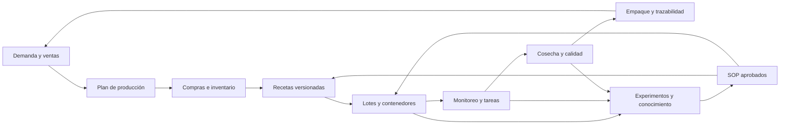

# Auditoría de diseño, experiencia y ecosistema

## Field OS / Setas de la Peña

**Fecha de auditoría:** 18 de julio de 2026  
**Artefacto evaluado:** `Field OS Simulador App.zip`  
**Alcance:** diseño visual, experiencia de uso, arquitectura de información, continuidad de los flujos, confiabilidad operativa, accesibilidad y visión de ecosistema.

---

## Veredicto ejecutivo

Field OS ya contiene el embrión de un producto excepcional: una identidad visual propia, un conocimiento técnico poco común y varias conexiones reales entre formulación, inventario, producción y experimentación. No es un mockup vacío. El formulador calcula, el inventario persiste localmente, la ficha traduce una receta a cantidades de producción y el banco climático simula actuadores.

Sin embargo, todavía es una **colección avanzada de prototipos**, no un sistema operativo confiable para una empresa. La brecha principal no es gráfica; es la falta de una única fuente de verdad, validaciones operativas, persistencia compartida, experiencia de campo offline y un modelo completo que conecte la demanda comercial con la producción y la trazabilidad.

La recomendación estratégica es conservar la dirección visual, pero reconstruir el producto alrededor de un solo ciclo operativo:

> **Planear → abastecer → formular → producir → monitorear → cosechar → empacar → vender → aprender.**

Hoy la aplicación cubre partes valiosas de formular, abastecer, producir, monitorear y aprender; planear demanda, calidad, empaque, ventas, clientes, cumplimiento y colaboración están ausentes o aislados.

---

## Qué ya funciona y merece conservarse

### 1. Identidad visual diferenciada

- La combinación de papel cálido, verde musgo, terracota, tipografía editorial y grabados de hongos crea una marca memorable.
- El sistema se siente agrícola y científico sin parecer software industrial genérico.
- La pantalla de inicio tiene una jerarquía clara y una pregunta de acción acertada: “¿Qué vas a hacer hoy?”.
- El banco climático convierte datos densos en una composición limpia y comprensible.

### 2. Modelo técnico profundo

- Catálogo amplio de ingredientes y especies.
- Cálculo de C:N, nitrógeno, humedad, eficiencia biológica estimada, costo y compatibilidad.
- Optimizador de recetas y recomendaciones de corrección.
- Ficha de producción con resolución de báscula, humedad real del insumo, agua neta, spawn y procedimiento.
- Inventario con compras, proveedores, movimientos y descuento FIFO.
- Bitácora experimental con bolsas, cosechas, contaminación, eficiencia biológica, score y veredicto.
- Banco climático con perfiles, escenarios, sensores sintéticos, actuadores y exportación CSV.

### 3. Conexiones prometedoras

- La bodega limita o informa el formulador.
- Una receta puede pasar a producción.
- Ejecutar un lote puede descontar inventario.
- Una receta puede originar una prueba experimental.
- El prototipo de campo contempla eventos rápidos, contenedores y etiquetas QR.

Estas conexiones son la mayor ventaja del proyecto. La siguiente versión debe convertirlas en contratos de datos fiables, no volverlas a diseñar desde cero.

---

## Hallazgos críticos

### P0 — Integridad y operación

#### 1. Se puede ejecutar una receta incompleta como si sumara 100%

Durante la prueba se añadieron dos ingredientes al 10% cada uno. La receta sumaba 20%, pero la ficha de producción:

- mostró una fila de total igual a 100%;
- mantuvo habilitado “Ejecutar lote”;
- calculó 0,59 kg de materia seca para 9 kg húmedos al 67% de humedad, cuando el total teórico es 2,97 kg;
- presentó un lote final de 9 kg aunque los insumos, el agua y el spawn visibles no cerraban esa masa.

**Riesgo:** pérdida de materias primas, contaminación, lotes irrepetibles y decisiones basadas en cifras contradictorias.

**Corrección obligatoria:** ninguna receta puede guardarse, producirse o descontar inventario si no suma 100,0% dentro de una tolerancia explícita. Debe existir una sola función de normalización y cálculo utilizada por Formulador, Ficha, Comparador, Dashboard y Bitácora. La interfaz debe mostrar una ecuación de balance de masa que cierre a cero antes de habilitar la ejecución.

#### 2. El paquete integrado no es ejecutable de forma fiable

- `Setas OS.dc.html` no completó el montaje y produjo un error de `MutationObserver`.
- El navegador intentó cargar literalmente `{{ simSrc }}`, `{{ climaSrc }}` y `{{ qrDataUrl }}`, evidencia de interpolación incompleta.
- `Field OS MVP-1.dc.html` solicita `tokens.css`, archivo ausente del ZIP. El prototipo carga sin su sistema visual completo.
- El simulador principal depende de React, Babel y Lucide servidos desde `unpkg.com`; sin internet puede no arrancar.

**Corrección obligatoria:** entregar una sola aplicación compilada, con dependencias locales, manifiesto de assets, prueba automática de arranque y modo offline. Los `.dc.html` pueden permanecer como fuentes de diseño, pero no como artefacto de producción.

#### 3. Los datos de campo son efímeros y los datos centrales viven en un navegador

- El simulador persiste múltiples entidades en `localStorage`.
- El prototipo Field OS conserva eventos principalmente en memoria y vuelve a datos sembrados al recargar.
- No hay cuentas, roles, sincronización, respaldo, control de concurrencia ni historial de cambios.

**Riesgo:** cada dispositivo puede tener una versión distinta de la verdad y una limpieza de navegador puede borrar la operación.

**Corrección obligatoria:** backend transaccional, IDs estables, auditoría append-only, copias de seguridad, exportación completa y una base local offline con cola de sincronización.

#### 4. Alertas climáticas sin semántica operativa

- La interfaz presenta 1.000 ppm como umbral de CO₂, pero el contador de alertas solo aumenta cerca de 1.900 ppm.
- Una vez crítico, el simulador generó alertas repetitivas cada hora, sin agrupar, reconocer, asignar ni cerrar la incidencia.
- La “intervención sugerida” puede cambiar sin crear un evento de decisión inmediatamente.

**Corrección obligatoria:** separar `aviso`, `alarma` y `crítico`; mostrar la regla que disparó el estado; deduplicar; permitir reconocer, asignar, silenciar temporalmente, escalar y cerrar; conservar tiempo de respuesta y resultado.

---

## Hallazgos de experiencia y diseño

### P1 — Arquitectura de información

#### Navegación solapada

- “Dashboard” aparece como módulo de recetas y como primera pestaña dentro de Bitácora.
- “Bitácora” es a la vez navegación global y pestaña contextual.
- “Recetas” contiene especies, formulador y comparación; “Bitácora” contiene lotes, bolsas, cosechas, comparador y ficha. El usuario debe aprender dos modelos paralelos.
- El flujo superior “Seleccionar → Formular → Diagnosticar → Producir → Registrar” promete linealidad, pero Bodega, Cronograma y Dashboard entran en varias etapas.

**Recomendación:** organizar por trabajo real y por rol. Un operario no necesita la misma navegación que el dueño o el responsable de producción.

#### Pantalla de formulación excesivamente densa

- Más de 70 ingredientes aparecen en una lista continua.
- Catálogo, disponibilidad, precio, compatibilidad, receta activa, score, batch, exportación y optimizador compiten en la misma superficie.
- La búsqueda ayuda, pero falta una entrada guiada por objetivo: “usar lo que hay”, “minimizar costo”, “reducir contaminación”, “probar especie” o “replicar receta aprobada”.

**Recomendación:** separar el flujo en tres estados: definir objetivo, construir/optimizar y validar/aprobar. La paleta completa debe abrirse por búsqueda o filtro, no dominar la pantalla inicial.

#### Affordances que prometen funciones inexistentes

En compras, “OCR / Foto” y “Email” se pueden seleccionar, pero no aparece captura, carga de archivo, buzón ni explicación de estado futuro.

**Recomendación:** ocultar funciones no implementadas o marcarlas como “Próximamente” sin permitir selección. En software operativo, una opción visible se interpreta como capacidad disponible.

### P1 — Legibilidad y accesibilidad

En la pantalla de formulación se midieron **286 controles visibles; 281 tenían menos de 44 px en al menos una dimensión**. Los botones `+`, `–` y bodega miden aproximadamente 22×22 px. Hay abundante texto entre 7,5 y 11 px.

Consecuencias:

- difícil uso con guantes, manos húmedas o en movimiento;
- errores de selección entre `+`, `–` y estado de bodega;
- fatiga visual en tablas y metadatos;
- navegación por teclado y lectores de pantalla incompleta;
- tres controles clave del formulador no tenían asociación programática clara con su etiqueta.

La tipografía de display funciona muy bien en títulos, pero no debe usarse para KPIs o números: el “4” de inventario puede leerse como una “A”.

**Estándar propuesto:** 44×44 px para acciones táctiles, 16 px para texto operativo principal, 12–14 px para metadatos, fuente monoespaciada o sans tabular para cantidades y estados, foco visible, labels programáticos, regiones `aria-live` para confirmaciones y soporte completo de teclado.

### P1 — Formulario experimental con desbordamiento

En escritorio, el modal “Nueva prueba experimental” comprime cuatro campos en una fila. “Humedad %” queda cortado y el campo casi desaparece; el contenido requiere scroll y las acciones quedan fuera del primer viewport.

**Recomendación:** máximo dos columnas; resumen fijo de receta arriba; acciones persistentes abajo; validación inline; grupos “identidad”, “proceso”, “hipótesis” y “resultado esperado”.

### P2 — Lenguaje y estados

- Parte de la interfaz usa “Constructor”, otra “Formulador”.
- “Score”, “EB”, “CO Base”, “FAE”, “CWLP” y “flush” requieren glosario contextual según el rol.
- Mensajes críticos se presentan junto a estimaciones sin distinguir dato medido, calculado, supuesto o ilustrativo.
- El Field OS inicia con fecha, operador y eventos de demostración fijos; esto puede parecer información real.

**Recomendación:** cada dato debe llevar origen: `medido`, `calculado`, `estimado`, `manual` o `simulado`. Los datos demo deben vivir en un modo demostración claramente señalizado.

---

## El ecosistema que falta

### Visión de producto

Field OS debe ser la capa operativa común de la empresa, no solo un simulador de sustratos. Su propósito es convertir cada insumo, lote, observación y venta en una decisión repetible.

### Superficies del ecosistema

#### A. Consola de Operaciones — web

Para jefe de producción y administración.

- tablero de hoy y excepciones;
- plan de lotes y capacidad de cámaras;
- formulación y versiones aprobadas;
- compras, inventario y costos;
- calidad, trazabilidad y retiros;
- rendimiento, mermas y rentabilidad;
- usuarios, roles, dispositivos y configuración.

#### B. Field OS — PWA móvil offline

Para operarios en laboratorio, bodega y cultivo.

- iniciar turno;
- escanear QR primero;
- ver siguientes tareas;
- registrar observación, traslado, contaminación o cosecha en pocos toques;
- tomar foto y dictar nota;
- continuar sin señal y sincronizar después;
- mostrar solo acciones válidas para el estado del contenedor.

#### C. Climate & Automation Hub

Para monitoreo y automatización modular.

- inventario de sensores y actuadores;
- reglas versionadas por cámara/fase/especie;
- telemetría con calidad de señal y última lectura;
- alarmas accionables;
- modo manual, sugerido y automático;
- prueba en banco digital antes de publicar una regla;
- historial de cambios, override manual y fail-safe.

#### D. Calidad, empaque y trazabilidad

- lote cosechado → clasificación → empaque → lote comercial;
- peso neto, merma, responsable y control de frío;
- QR de consumidor con especie, fecha, origen, conservación y recetas;
- capacidad de rastrear hacia atrás hasta spawn, receta e insumos;
- registro de no conformidad y retiro.

#### E. Comercial y clientes

- clientes B2B/B2C, listas de precios y acuerdos;
- pedidos, disponibilidad prometible y rutas de entrega;
- demanda prevista que alimente el plan de producción;
- facturación/exportación contable cuando sea necesaria;
- feedback de calidad conectado al lote.

#### F. Conocimiento y SOP

- hipótesis → experimento → observaciones → resultado → decisión;
- comparación estadística por receta, cepa, operador, cámara y temporada;
- promoción explícita de una receta o práctica a SOP;
- control de versión, aprobación, entrenamiento y fecha de vigencia;
- biblioteca de incidentes y acciones correctivas.

---

## Modelo de datos mínimo

La siguiente versión debe compartir estas entidades entre todos los módulos:

| Dominio | Entidades principales |
|---|---|
| Organización | empresa, sede, zona, cámara, usuario, rol, turno |
| Biología | especie, cepa, proveedor de spawn, lote de spawn |
| Abastecimiento | proveedor, ingrediente, compra, lote de ingrediente, movimiento, costo |
| Formulación | receta, versión, ingrediente de receta, supuesto, validación, aprobación |
| Producción | orden, lote, contenedor/bolsa, etapa, tarea, operador, equipo |
| Clima | dispositivo, sensor, lectura, regla, actuador, comando, alarma, reconocimiento |
| Calidad | observación, foto, contaminación, no conformidad, descarte, resultado de control |
| Cosecha | cosecha, flush, peso, grado, destino, merma |
| Comercial | producto, lote empacado, cliente, pedido, entrega, devolución |
| Conocimiento | experimento, tratamiento, control, resultado, veredicto, SOP, versión |

Principio clave: **una receta no es un arreglo editable; es una versión aprobable e inmutable una vez usada por un lote**. Cualquier cambio crea una nueva versión.

---

## Nueva arquitectura de información

### Navegación del jefe de producción

1. **Hoy** — tareas, alarmas, bloqueos y decisiones.
2. **Plan** — demanda, capacidad, cronograma y órdenes.
3. **Producción** — lotes activos, recetas y ejecución.
4. **Ambiente** — cámaras, telemetría, alarmas y reglas.
5. **Inventario** — stock, compras, consumos y proveedores.
6. **Calidad** — contaminación, cosechas, empaque y trazabilidad.
7. **Aprender** — experimentos, comparaciones y SOP.
8. **Comercial** — pedidos, clientes y entregas.

### Navegación del operario

1. **Mi turno**
2. **Escanear**
3. **Registrar**
4. **Alertas**
5. **Buscar**

No debe ver un simulador complejo o un dashboard financiero si su tarea es pesar, inocular o cosechar.

---

## Automatización modular de bajo y mediano costo

### Nivel 0 — disciplina digital

- QR por lote/contenedor;
- checklists y tiempos;
- captura manual de clima;
- registros de inventario y cosecha;
- alertas basadas en tareas vencidas.

### Nivel 1 — observabilidad

- sensores económicos redundantes de temperatura y HR;
- CO₂ en cámaras críticas;
- nodo local con buffer cuando cae internet;
- dashboard, historial y alertas;
- calibración y salud del sensor.

### Nivel 2 — recomendación asistida

- Field OS propone ventilación, humedad o calentamiento;
- el operario confirma;
- se registra decisión, tiempo de respuesta y efecto;
- reglas se prueban primero en Climate Bench.

### Nivel 3 — control automático supervisado

- relés/variadores modulares con límites físicos;
- overrides locales;
- watchdog y estados seguros por falla;
- aprobación de reglas y rollback;
- alarmas independientes del mismo controlador.

No conviene saltar al control automático hasta que sensores, calibración, SOP y trazabilidad de decisiones sean confiables.

---

## Roadmap recomendado

### Fase 0 — estabilizar el prototipo

- bloquear producción de recetas que no cierran a 100%;
- unificar cálculo y unidades;
- corregir el paquete y eliminar dependencias CDN;
- arreglar `tokens.css` y el montaje de Setas OS;
- ocultar OCR/Email hasta implementarlos;
- aumentar tamaños táctiles y texto;
- corregir el modal experimental;
- crear smoke tests de cada flujo crítico.

**Criterio de salida:** una receta válida produce siempre el mismo balance de masa en todas las pantallas y sobrevive a recarga/exportación.

### Fase 1 — núcleo operativo compartido

- backend, autenticación, roles y auditoría;
- recetas versionadas;
- lotes, bolsas y eventos persistentes;
- inventario por lote de proveedor y consumo FIFO;
- órdenes de producción y tareas;
- importación/exportación y backups.

**Criterio de salida:** dos dispositivos ven y actualizan el mismo lote sin perder trazabilidad.

### Fase 2 — Field OS offline + clima

- PWA instalable y sincronización offline;
- escaneo QR, fotos y captura rápida;
- cámaras y sensores reales;
- alarmas con reconocimiento y escalamiento;
- banco de reglas con publicación controlada.

**Criterio de salida:** un turno completo puede ejecutarse sin señal y sincronizarse sin duplicados.

### Fase 3 — calidad, ventas y aprendizaje

- empaque y lote comercial;
- pedidos y demanda;
- trazabilidad hacia consumidor/cliente;
- costos completos y rentabilidad por lote;
- experimentos comparables y promoción a SOP.

**Criterio de salida:** un pedido puede rastrearse hasta sus cosechas, bolsas, receta e insumos.

---

## Principios de diseño para la siguiente versión

1. **Excepciones primero:** el inicio muestra qué requiere acción, no todos los datos.
2. **Escanear antes que buscar:** en campo, el QR identifica el contexto.
3. **Escribir lo mínimo:** chips, voz, foto y valores por defecto; texto libre solo cuando agrega valor.
4. **Una cifra, una verdad:** el mismo motor de cálculo sirve a toda la aplicación.
5. **Origen visible:** medido, manual, calculado, estimado o simulado.
6. **Offline por defecto:** la finca no puede depender de conectividad continua.
7. **Automatización reversible:** override, fail-safe, historial y rollback.
8. **Diseño por rol:** cada persona ve decisiones y acciones de su trabajo.
9. **Aprobación explícita:** receta, regla climática y SOP tienen versión y responsable.
10. **La marca enmarca; los datos mandan:** tipografía editorial para identidad, tipografía tabular para operación.

---

## Decisión recomendada

No ampliar todavía el número de módulos visuales. La inversión de mayor retorno es convertir el flujo actual **receta → lote → inventario → bitácora** en un núcleo confiable, compartido y offline. Después se conectan clima, calidad y ventas sobre ese mismo modelo.

La visión correcta no es “un simulador con más pestañas”. Es un **sistema operativo agrícola especializado en setas**, donde cada pantalla representa una etapa del mismo objeto trazable y cada experimento mejora la siguiente versión del proceso.
