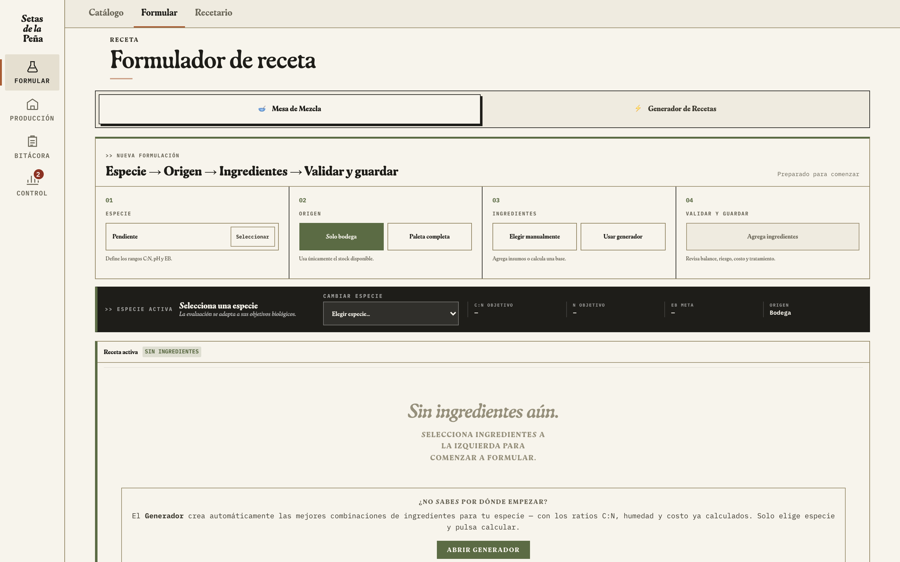
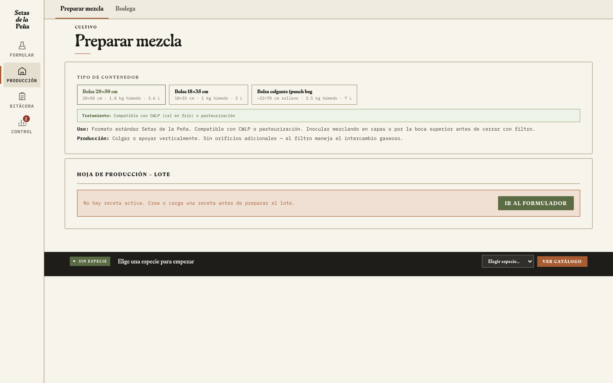
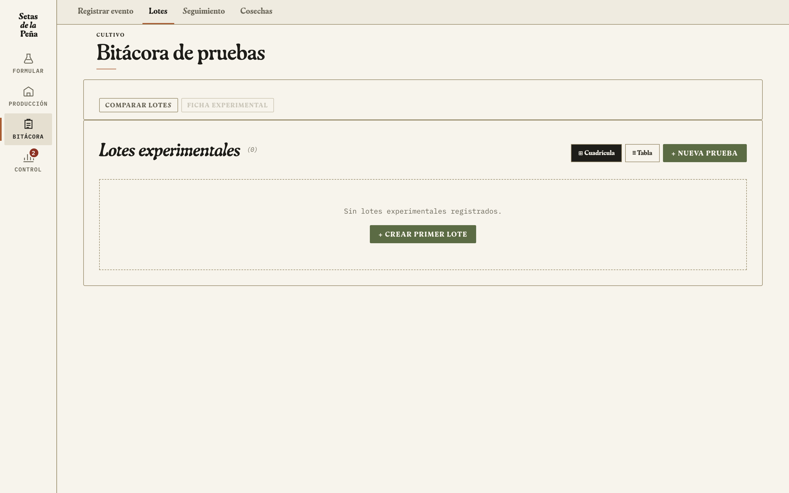
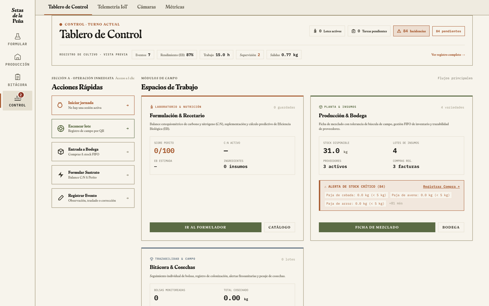

# Setas OS — Manual Operativo y Guía de Uso Canónica

**Setas de la Peña** · Granja de Cultivo & I+D de Hongos Comestibles y Medicinales  
**Ubicación:** Tenjo, Cundinamarca, Colombia (2.585 m s. n. m. / presión barométrica ~74 kPa)  
**Sistema:** Field Operating System (FOS) / Setas OS v5 (Arquitectura Canónica 2026)  
**Documento:** SOP-SYS-001 · Versión 2.1 (Actualizado con Production Learning Loop v1 & Hardware BOM Agosto 2026)  
**Estado:** Canónico / Operativo en Producción  

---

## 1. Introducción y Filosofía del Sistema

### 1.1 ¿Qué es Setas OS?
**Setas OS** (Field Operating System) es la plataforma de software de precisión desarrollada para gestionar el ciclo de vida completo de producción e investigación micológica en **Setas de la Peña**.

Diseñado para las condiciones agroclimáticas de la Sabana de Bogotá (Tenjo), Setas OS no es un SaaS genérico, sino un sistema integrado de aprendizaje y producción continua (*Production Learning Loop*). Unifica:
1. **Modelado y balance estequiométrico de sustratos:** Relación $C:N$, nitrógeno asimilable, balance hídrico y $pH$.
2. **Control de inventarios y bodega bajo modelo FIFO estricto.**
3. **Planificación de siembras y ejecución de tratamientos térmicos (Pasteurización vs. Autoclave 15 PSI).**
4. **Bitácora inmutable de campo y trazabilidad unívoca de lote (`LP-XXXX-AA`).**
5. **Telemetría normalizada y control ambiental (Banco Climático y RoomCycle).**
6. **Bucle de Aprendizaje y Evidencia Histórica (Production Learning Loop v1):**
   $$\text{Lote de Insumos} \rightarrow \text{Versión Receta} \rightarrow \text{Lote de Producción} \rightarrow \text{RoomCycle} \rightarrow \text{Telemetría} \rightarrow \text{Cosechas} \rightarrow \text{EB/Costo} \rightarrow \text{Evidencia} \rightarrow \text{Contexto Perito}$$

```
┌─────────────────────────────────────────────────────────────────────────────┐
│                     ARQUITECTURA CANÓNICA DE SETAS OS                        │
├─────────────────┬───────────────────┬───────────────────┬───────────────────┤
│    FORMULAR     │    PRODUCCIÓN     │     BITÁCORA      │      CONTROL      │
├─────────────────┼───────────────────┼───────────────────┼───────────────────┤
│ • Catálogo (9)  │ • Planificador    │ • Registro Táctil │ • Tablero General │
│ • Barra Sticky  │ • Preparar Mezcla │ • Lotes LP-XXXX   │ • Cámaras/Clima   │
│ • Recetario     │ • Bodega FIFO     │ • Bolsas/Incub.   │ • Métricas & VPD  │
│ • Perito IA     │ • Ficha FOS-02    │ • Cosechas & EB   │ • Telemetry V1    │
└─────────────────┴───────────────────┴───────────────────┴───────────────────┘
```

### 1.2 Regla de Seguridad y Clases de Datos
Setas OS distingue estrictamente entre cuatro clases de datos que nunca deben sustituirse en silencio:
1. **Setpoints Operacionales:** Objetivos programados por el usuario para una sala (`RoomCycle`).
2. **Límites de Validación Física:** Rangos físicamente posibles para los sensores (lecturas fuera de rango van a cuarentena).
3. **Objetivos de Literatura Científica:** Parámetros de referencia teóricos.
4. **Distribuciones Históricas Medidas:** Datos reales observados en cosechas anteriores de la finca.

---

## 2. Los Cuatro Espacios de Trabajo Principales

El sistema organiza la operación diaria en cuatro espacios de trabajo accesibles desde el riel de navegación:

```
[ Formular ] ─── [ Producción ] ─── [ Bitácora ] ─── [ Control ] ─── [ Más... ]
```

---

### 2.1 Espacio 1: Formular (Bioquímica & Simulación de Sustratos)



El espacio **Formular** cuenta con una **Barra Sticky Superior Unificada** que mantiene siempre visible la *Receta Activa*, permitiendo editar proporciones, bloquear ingredientes y visualizar instantáneamente el impacto en $C:N$, $pH$, balance hídrico y costo por kilogramo.

#### Catálogo de Especies Soportadas
Setas OS contiene matrices fisiológicas calibradas para 9 especies:

| Especie | Nombre Común | Rango $C:N$ Óptimo | Temp. Incubación | Temp. Fructificación | HR Óptima | Tratamiento Térmico Requerido |
|:---|:---|:---:|:---:|:---:|:---:|:---|
| *Pleurotus ostreatus* | Orellana Gris | 25:1 – 50:1 (ideal 35:1) | 22–25 °C | 15–20 °C | 85–90 % | Pasteurización / Vapor |
| *P. ostreatus var. florida* | Orellana Blanca | 25:1 – 45:1 (ideal 32:1) | 23–26 °C | 18–24 °C | 85–92 % | Pasteurización / Vapor |
| *Pleurotus djamor* | Orellana Rosa (Prioritaria) | 25:1 – 40:1 (ideal 30:1) | 26–28 °C | 22–28 °C | 85–90 % | Pasteurización / Vapor |
| *Pleurotus eryngii* | Seta de Cardo | 20:1 – 28:1 (ideal 24:1) | 21–24 °C | 13–16 °C | 88–92 % | Esterilización (Autoclave 15 PSI) |
| *Lentinula edodes* | Shiitake | 35:1 – 70:1 (ideal 50:1) | 22–24 °C | 12–18 °C | 80–85 % | Esterilización (Autoclave 15 PSI) |
| *Hericium erinaceus* | Melena de León | 30:1 – 45:1 (ideal 35:1) | 21–24 °C | 16–20 °C | 85–92 % | Esterilización (Autoclave 15 PSI) |
| *Ganoderma lucidum* | Reishi / Lingzhi | 45:1 – 80:1 (ideal 60:1) | 24–28 °C | 25–30 °C | 80–90 % | Esterilización (Autoclave 15 PSI) |
| *Flammulina velutipes* | Enoki | 25:1 – 40:1 (ideal 27:1) | 20–22 °C | 8–12 °C | 85–90 % | Esterilización (Autoclave 15 PSI) |
| *Pholiota nameko* | Nameko | 30:1 – 50:1 (ideal 38:1) | 21–24 °C | 10–15 °C | 90–95 % | Esterilización (Autoclave 15 PSI) |

#### Estructura de Capas de una Receta
1. **Base Carbono (55–75% masa seca):** Paja de trigo, aserrín de roble, bagazo de caña, cascarilla de arroz, tuzas de maíz.
2. **Suplemento Nitrogenado (15–30% masa seca):** Salvado de trigo, afrecho cervecero, salvado de avena, harina de soya, borra de café tratada.
3. **Aditivos Estructurantes & Buffers (2–5% masa seca):**
   - **Carbonato de Calcio ($\text{CaCO}_3$):** Buffer de $pH$ para mantener rango $6.0–6.8$.
   - **Yeso Agrícola ($\text{CaSO}_4 \cdot 2\text{H}_2\text{O}$):** Aporta calcio/azufre y evita la compactación del sustrato.
   - **Zeolita:** Microaireación y retención de humedad.

#### Puerta de Promoción de Ensayos (`experiment-model.js`)
Setas OS formaliza el paso de una receta de prueba a SOP canónico:
- Un ensayo de una sola réplica es clasificado como `exploratorio`.
- Para considerarse evidencia comparativa (`comparative_evidence_candidate`), el protocolo exige **diseño con control, tratamientos y mínimo 3 réplicas aleatorizadas** con trazabilidad de ingredientes.

---

### 2.2 Espacio 2: Producción (Bodega, Planificación y Mezclado)



#### Gestión de Bodega FIFO (First-In, First-Out)
- Control de materias primas con proveedor, fecha de recepción y lote.
- Descuento de stock en tiempo real al generar la orden de preparación de mezcla.
- Alertas de stock crítico con umbral configurable por insumo.

#### Preparación de Lote y Ficha de Campo (FOS-02)
1. Selección de receta aprobada y definición de volumen total en masa seca.
2. Prueba de puño (*squeeze test*) para corroborar humedad ($63–65\%$).
3. Dosificación de inóculo (*grain spawn*): tasa del $5\%$ al $10\%$ del peso seco.
4. Generación del código unívoco de lote (FOS-01): `LP-XXXX-AA` (ej. `LP-0418-26`).
5. Impresión de la etiqueta térmica aislada o Ficha de Campo FOS-02 con código QR.

#### Etiquetas Térmicas de Trazabilidad (FOS-03) e Integración al Proceso
Para garantizar que la información digital en Setas OS coincida exactamente con la realidad física en las salas de cultivo, se utiliza un sistema de **identificación física dual** basado en impresión térmica directa sobre soportes de polipropileno (PP) resistentes a humedad relativa $>85\%$ y condensación:

1. **Etiqueta de Bloque (FOS-03 - 40×30 mm o 60×40 mm):**
   - **Hardware Utilizado:** Impresora térmica portátil (ej. *Phomemo M110* o *Brother QL* series) conectada por Bluetooth a la PWA móvil del operario.
   - **Momento de Impresión:** En el **Día 0 (Inoculación)**, al presionar "Preparar Lote" en Setas OS, el sistema genera el código de lote irreversible y permite la impresión inalámbrica inmediata de las etiquetas necesarias (una por cada bolsa/bloque inoculado).
   - **Información del Bloque:** Cada bloque recibe su etiqueta individual con: el código unívoco (`LP-XXXX-AA`), especie (*ej. Pleurotus ostreatus*), lote de sustrato (`SP-XXX-AA`), fecha de inoculación, operario a cargo y coordenada de estantería. Esto previene mezclas accidentales de variedades en el túnel de incubación.

2. **Ficha de Cabecera de Estantería con QR (FOS-02):**
   - Se imprime en formato extendido y se cuelga en el soporte frontal de cada nivel del estante en la carpa (ej: *CLOUDLAB 844*).
   - Contiene un código **QR-First** que vincula la estantería física con la base de datos de Firestore.

3. **Ciclo de Trazabilidad en Campo (Escaneo QR):**
   - **Inspección diaria:** El operario escanea el QR con la cámara de su smartphone. Setas OS reconoce el lote al instante y abre la Bitácora de ese lote específico.
   - **Control de estado:** Solo se muestran las acciones válidas para el estado del lote en ese momento (ej: registrar contaminación, transicionar a `induction`, o registrar cosecha), eliminando errores de entrada de datos.
   - **Métricas automatizadas:** Al pesarse las cosechas, los datos ingresados se asocian directamente al lote escaneado, retroalimentando el *Production Learning Loop v1*.

4. **Empaque y Despacho Comercial (FOS-PKG-001):**
   - En la cosecha, se generan etiquetas de empaque personalizadas para bandejas Kraft (80×120 mm) o fajas para cajas de madera Gourmet (180×60 mm). Estas etiquetas omiten códigos internos de desarrollo de software pero mantienen la trazabilidad del lote (`LP-XXXX-AA`) y la fecha de cosecha de precisión, visible en el restaurante o punto de venta final.

---

### 2.3 Espacio 3: Bitácora (Cuaderno de Campo, Telemetría y Cosechas)



#### Máquina de Estados del Ciclo de Vida del Lote
El lote avanza a través de 11 estados canónicos:

```
 planned ──> mix_prepared ──> thermal_treatment ──> cooling ──> inoculated
                                                                   │
 closed <── resting <── fruiting <── induction <── maturation <────┴─ incubation
   │
   └── [Estados de Excepción: quarantine | discarded | failed]
```

#### Captura Rápida de Campo (QR-First)
Al escanear el QR del lote en smartphone, Setas OS despliega únicamente las acciones válidas para el estado actual (inspección de micelio, registro ambiental, cambio de fase, reporte de contaminación o pesaje de cosecha).

#### Registro de Cosechas & Eficiencia Biológica ($EB\%$)
$$\text{Eficiencia Biológica } (EB \%) = \frac{\text{Peso Fresco Total Cosechado (kg)}}{\text{Peso Sustrato Seco Inicial (kg)}} \times 100$$
$$\text{Tasa de Retorno } (TR \%) = \frac{\text{Peso Fresco Total Cosechado (kg)}}{\text{Peso Sustrato Húmedo Inoculado (kg)}} \times 100$$

---

### 2.4 Espacio 4: Control (Cámaras, Telemetría V1 & Hardware Real Tenjo)



#### Hardware Real Desplegado en Tenjo (Agosto 2026)
- **Cámara Principal:** AC Infinity CLOUDLAB 844 (Carpa 4×4 ft / 1.22 × 1.22 × 2.00 m) con 2 estanterías cromadas de 5 niveles (capacidad 20–32 bloques).
- **Cámara I+D / Cuarentena:** Martha Tent 65" (~165 × 70 × 51 cm).
- **Incubadora Controlada:** Caja térmica de 100 L con malla radiante QuietWarmth (90 W @ 120 V) y calefactor cerámico PTC (24 V / 100 W).
- **Climatización y FAE:** Humidificador CloudForge T7 (15 L), extractores AC Infinity Cloudline H4 y ventiladores en línea Raxial S4.
- **Sensores Ambientales & Altitud:**
  - **Sensirion SCD30:** NDIR CO₂ con compensación barométrica por altitud obligatoria configurada a `altitude_compensation: 2600` (Tenjo a 2.585 m s. n. m.).
  - **Sensirion SHT31 / SHT45:** Temperatura y HR de alta precisión con elemento calefactor anticondensación.
  - **Dallas DS18B20:** Sondas sumergibles 1-Wire para temperatura interna de sustrato y placas térmicas.
  - *Regla:* El sensor interno del humidificador VIVOSUN H05 queda descartado por sesgo de +30–35% observado en pruebas.

#### Contrato de Telemetría Normalizada (`telemetry-contract.js`)
Métricas estandarizadas bajo `setas.telemetry.v1`:
- `temperature_c`
- `rh_pct`
- `co2_ppm`
- `substrate_temperature_c`

Toda lectura registra sala, dispositivo, timestamp ISO y estado de calidad. Las lecturas físicamente imposibles entran en estado `quarantine` en vez de promediarse erróneamente.

---

### 2.5 Módulos Complementarios ("Más")
- **Costos:** Margen de contribución, costo directo de sustrato, energía y spawn por kilo producido.
- **Calidad:** Detección de patógenos (*Trichoderma*, *Neurospora*, bacterias) con protocolo de aislamiento inmediato.
- **Aprender:** Repositorio de SOPs y biblioteca técnica.
- **Comercial (FOS-06):** Hoja de mercado para venta directa a restaurantes sin códigos internos visibles.

---

## 3. Normativa Visual del Design System (FOS)

```css
/* Paleta Cromática FOS */
--paper-0: #F7F4EC; /* Fondo principal de página / lienzo cálido */
--paper-1: #EFEBE0; /* Paneles y secciones elevadas */
--paper-2: #E5DFD0; /* Celdas recesadas y franjas de tabla */

--ink-0:   #1E1D19; /* Texto primario (casi negro cálido) */
--ink-1:   #3C392F; /* Texto secundario */
--ink-2:   #6B6759; /* Metadata, captions y rótulos técnicos */

--line-0:  #988C6C; /* Filete hairline (3.03:1 sobre paper-0) */
--line-1:  #8C7F5B; /* Filete fuerte y bordes de tabla */
--line-2:  #1E1D19; /* Filete pesado y marcos exteriores */

/* Acentos Funcionales (Clasificación y Estado Únicamente) */
--accent-olive:       #5B6B44; /* Activo, óptimo, validado */
--accent-terracotta:  #A85C32; /* Atención, alerta moderada */
--accent-blue-grey:   #5E7080; /* Información técnica, enlaces */
--accent-mushroom:    #7A6A52; /* Archivado, reposo, lote cerrado */
--accent-rust:        #8C3223; /* Error crítico / contaminación exclusivamente */
```

### Componentes FOS Principales:
- **FOS-01 (Bloque de Lote):** Contenedor estructurado en fuente mono con cifras tabulares.
- **FOS-02 (Ficha de Campo):** Cuadrícula de celdas de mínimo 48px de altura táctil.
- **FOS-05 (Estados Tipográficos):** Estado en texto mono mayúscula con filete superior (`border-top: 1.5px solid currentColor`), eliminando badges redondeados o pastillas con sombra.

---

## 4. Rutina Operativa Paso a Paso (Ciclo de 60 Días)

| Día | Fase | Operación en Granja | Acción en Setas OS |
|:---:|:---|:---|:---|
| **Día -1** | Planificación | Inventario de paja, salvado y spawn en nevera. | Validar receta en **Formular**. Crear orden en **Planificar**. |
| **Día 0** | Siembra | Hidratar paja (65%), pasteurizar/enfriar e inocular al 8%. | Registrar pesaje en **Producción**. Emitir lote `LP-0418-26`. Imprimir Ficha FOS-02. |
| **Día 1–18** | Incubación | Ubicar en Sala 1 (oscuridad, 23°C). | Mover lote a `incubation` en **Bitácora**. Registrar inspecciones semanales. |
| **Día 19–21** | Inducción | Mover a CLOUDLAB 844. Bajar a 18°C, luz 12h y FAE. | Transicionar a `induction` en **Bitácora**. Verificar SCD30 en **Control**. |
| **Día 22–28** | Fructificación | Apertura de bolsas. Desarrollo de primordios. | Transicionar a `fruiting`. Anotar fecha de primer primordio visible. |
| **Día 29–31** | Cosecha 1 | Corte de racimos de primera oleada (Flush 1). | Registrar pesaje limpio en **Cosechas**. Setas OS calcula $EB_1$. |
| **Día 32–40** | Reposo | Rehidratar bloques en agua limpia fría por 12–24h. | Cambiar estado del lote a `resting`. |
| **Día 41–48** | Cosecha 2 | Cosecha de segunda oleada (Flush 2). | Registrar pesaje de Flush 2 y calcular $EB_{\text{acumulada}}$. |
| **Día 50** | Cierre | Compostar sustrato gastado y desinfectar carpa con peracético. | Cambiar a `closed`. Exportar datos al **Production Learning Loop**. |

---

## 5. Matriz de Diagnóstico y Resolución de Problemas (Troubleshooting)

| Síntoma en Granja | Causa Biológica / Técnica | Acción Correctiva Inmediata | Registro en Setas OS |
|:---|:---|:---|:---|
| **$EB_{\text{real}} \ll EB_{\text{esperada}}$** | Baja tasa de inóculo, sustrato mal mezclado o pérdida de humedad. | Subir spawn al 10% en próxima mezcla; verificar hidratación en prueba de puño. | Comparar en **Bitácora** con histórico; ajustar receta en **Formular**. |
| **Aborto de Primordios** | Caída de humedad ($<80\%$) o corriente de aire seco directo. | Ajustar ciclo del CloudForge T7; reorientar ventilador Noctua de recirculación. | Registrar incidencia en **Bitácora**; calibrar alarma en **Control**. |
| **Estípites Largos / Sombreros Enanos** | Exceso de $\text{CO}_2$ ($>1.100\text{ ppm}$) por ventilación insuficiente. | Incrementar potencia del extractor Cloudline H4. | Verificar telemetría SCD30 en **Control &rarr; Tablero**. |
| **Parches Verde Oscuro (*Trichoderma*)** | Pasteurización incompleta o siembra sobre sustrato caliente ($>28^\circ\text{C}$). | Aislar y embolsar bloque inmediatamente; retirar de sala y desinfectar. | Cambiar estado a `discarded` (motivo: patógeno *Trichoderma*). |
| **Micelio Velloso / Estroma Denso** | Exceso de suplementación nitrogenada ($C:N < 20:1$) o calor en incubadora. | Bajar proporción de salvado; verificar sensor DS18B20 de fondo de incubadora. | Ajustar formulación en **Formular** para mantener $C:N$ en 35:1. |
| **Pérdida de Conexión / Sin Internet** | Operación en zona sin cobertura WiFi en finca. | Ninguna: Setas OS opera 100% offline en `localStorage`. | Al reconectar, verificar indicador de sincronización en encabezado. |

---

## 6. Persistencia, Seguridad & Herramientas MCP

1. **Modo Offline PWA:** Todo evento se graba instantáneamente en `localStorage`.
2. **Sincronización Cloud Firebase:** Conexión segura con Firestore para consolidación entre dispositivos.
3. **Servidor MCP `setas_bridge_mcp.py`:** Expone el repositorio en vivo para lectura y coordinación de agentes de IA sin sobrescrituras accidentales.

---

**Setas de la Peña — Tenjo, Colombia**  
*Mística Rural de Precisión · Documentación Oficial de Ingeniería Agronómica*
